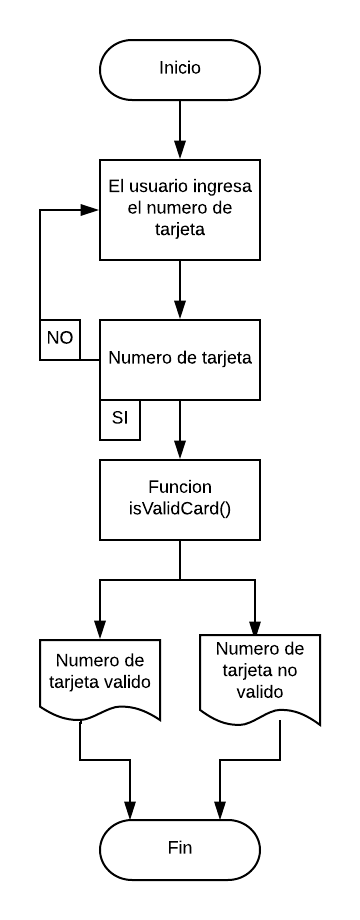

# TARJETA DE CREDITO.
### Descripión:

Crea una web que pida, por medio de un prompt(), el número de una tarjeta de crédito y confirme su validez según el algoritmo de Luhn.

### Consideraciones Específicas:

* Tu código debe estar compuesto por una función: isValidCard.
* El usuario no debe poder ingresar un campo vacío.

### Tips:

1.- Agregar los numeros de la tarjeta a un array en orden inverso.

2.- A todos los numeros en las posiciones pares se les debe multiplicar por dos y si el doble de ese numero es
    mayor igual a 10 debemos sumar los digitos del resultado.

3.- Ahora deberas sumar los numeros e las posiciones impares y el numero que se obtendra de las posiciones pares.

4.- Cuando ya se tenga el resultado se debera obtener el residuo de la division entre 10 y si es igual a 0, significa que es
    una tarjeta de credito valida.

## Pseudocódigo:
### Descripción:
El Pseudocodigo me sirve para detallar a grandes razgos los pasos fundamentales de tu codigo a ejecutar.

1.- Pedir el numero de la tajeta de credito.

2.- Pasar los numeros a un array en orden inverso.

3.- Aplicar las operaciones mediante la funcion isValidcard().

4.- Verificar si el numero de tarjeta es valido o no.

4.- Retornar si el numero de tarjeta es valido o no.

## Diagrama de flujo.

La secuencia grafica de nuestro Pseudocodigo

